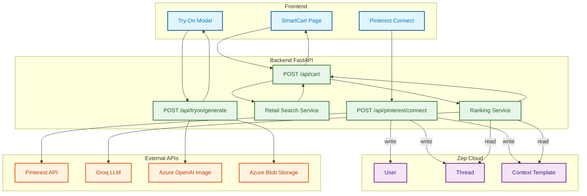

# 🛍️ Agentic Cart Assistant

The **Agentic Cart Assistant** is a next-generation AI shopping companion that revolutionizes the e-commerce experience. It acts as a universal personal shopper that not only finds and ranks products from **any online store** but also **autonomously navigates retailer websites** to add items to the cart and initiate checkout—all from a single, unified interface.


---

## 🏗️ Architecture & Data Flow

The system orchestrates a complex interaction between the user, AI agents, and external services. Below is the high-level data flow rooted in **Zep MCP** for long-term memory and **FastAPI** for orchestration.



### 🧠 Core Components

1.  **Backend (FastAPI)**: The central brain. Handles cart logic (`C1`), invokes ranking (`R1`), and connects to Pinterest (`P1`) and Try-On services (`T1`).
2.  **Zep Cloud**: The memory layer. Stores User profiles (`ZU`), conversational Threads (`ZT`), and Context Templates (`ZCTX`) used for personalized ranking.
3.  **External AI**: 
    - **Groq LLM**: Powers the intelligent ranking and decision making.
    - **Azure OpenAI**: Generates the virtual try-on images.
    - **Pinterest API**: Sources user style preferences.

---

## ✨ Key Features

- **🤖 Universal Autonomous Agent**
  - **Heuristic DOM Analysis**: Instead of brittle hardcoded selectors, the agent uses a **scoring algorithm** to "read" the page structure in real-time. It identifies "Add to Cart" buttons, size dropdowns, and color swatches by analyzing semantic HTML attributes, aria-labels, and relative positioning.
  - **Self-Healing Fallbacks**: If a direct product link redirects to a 404 or category page (common with dynamic inventory), the agent detects the mismatch and actively uses the retailer's internal site search to locate the specific product match.
  - **Stealth Infrastructure**: Built on top of `playwright-stealth`, the agent automatically injects evasive scripts to bypass sophisticated bot detection, ensuring high success rates on major retail sites.

- **� Style DNA & Memory Context (MCP)**
  - **Long-Term Memory (Zep)**: The system maintains a persistent `UserMemory` graph that evolves with every interaction. It learns preferred brands, fit preferences (e.g., "likes wide leg"), and color palettes.
  - **Contextual Re-Ranking**: Search results are passed through an LLM (Groq) that re-ranks items based on your stored **Style DNA**. If you prefer minimalist aesthetics, flashy items are deprioritized automatically.
  - **Pinterest Integration**: Connect your account to have the system scrape your boards, extract visual attributes, and seed your Style DNA with your aspirational wardrobe.

- **🔎 Intelligent Product Search**
  - **Global Aggregation**: Simultaneously queries multiple search APIs (Serper, Tavily) to fetch real-time product data from across the open web, not just a closed catalog.
  - **Clean Data Normalization**: Raw search results are parsed, cleaned, and normalized into a unified schema, removing ads and irrelevant content before they reach the user.

- **🛒 Smart Cart & Budgeting**
  - **Unified Checkout**: Add items from American Eagle, Gap, and bespoke boutiques into a single cart session.
  - **Financial Guardrails**: The "Budget Guard" monitors your total cart value against a preset limit, offering real-time warnings to prevent overspending.

- **👗 Virtual Try-On**
  - **Generative AI Preview**: A dedicated pipeline sends product images and user photos to **Azure OpenAI**, generating realistic visualizations of how the clothing would look on the user.

---

## 🤖 Detailed Checkout Automation Flow

When you click **"Confirm & Pay"**, the `AutomationService` orchestrates a complex sequence of autonomous actions:

### 1. **Persistent Session Initialization**
   - The agent launches a browser context with a **persistent user data directory**. This preserves your login sessions, cookies, and local storage, ensuring you don't need to re-login to retailer sites every time.
   - It rotates user-agents and applies fingerprint masking to appear indistinguishable from a standard Chrome user.

### 2. **Navigation & Smart Verification**
   - **Direct Navigation**: It attempts to load the specific product URL.
   - **Page Type Detection**: It runs a heuristic check to confirm it has landed on a Product Detail Page (PDP). It looks for "Add to Cart" buttons and price elements.
   - **Autopilot Correction**: If the check fails (e.g., you are on a category page), it triggers a recovery workflow:
     1. Locates the site's search bar.
     2. Types the exact product name.
     3. Selects the most relevant result from the dropdown or search results page.
     4. Verifies the new page is the correct product.

### 3. **Heuristic Variant Selection**
   - **Color Matching**: The agent scans the DOM for elements matching your selected color (e.g., "Tarte à la cerise"). It handles multi-language sites by checking against a dictionary of color terms.
   - **Size Intelligence**: It identifies size selectors not just by ID, but by context—finding dropdowns or button grids located near labels like "Size", "Taille", or "Dimensions".

### 4. **Dynamic Cart Interaction**
   - **Action Execution**: It clicks the "Add to Cart" button (detecting variations like "Add to Bag", "Ajouter au panier").
   - **Success Verification**: It waits for visual confirmation, such as a "Added to Cart" toast notification or a cart counter update.

### 5. **Checkout Handoff**
   - **Pathfinding**: The agent actively hunts for the path to checkout. It prioritizes post-add modals ("View Bag") and fallback header icons.
   - **Secure Handoff**: Once on the checkout page, the agent intentionally pauses and hands control back to you. This "Human-in-the-Loop" design ensures that sensitive credit card details are entered manually by you, maintaining zero-trust security.

---

---

## 🚀 Installation & Setup

### Prerequisites
- **Node.js**: v18+
- **Python**: v3.10+
- **Browser**: Chrome/Chromium installed
- **API Keys**: Serper (Search), Zep (Memory)

### 1️⃣ Backend Setup

1. **Clone & CD**: `cd backend`
2. **Virtual Env**:
   ```bash
   python -m venv .venv
   source .venv/bin/activate  # or .venv\Scripts\activate (Windows)
   ```
3. **Install**:
   ```bash
   pip install -r requirements.txt
   playwright install chromium
   ```
4. **Config**: Create `.env` with `SERPER_API_KEY`, `ZEP_API_KEY`.
5. **Run**: `uvicorn app.main:app --reload --port <YOUR_PORT>`

### 2️⃣ Frontend Setup

1. **CD**: `cd frontend`
2. **Install**: `npm install`
3. **Run**: `npm run dev`

---

## 📂 Project Structure

```
agentic-cart-assistant/
├── backend/
│   ├── app/
│   │   ├── services/
│   │   │   ├── RetailProduct/   # Search & Ranking logic
│   │   │   ├── automation_service.py # Core agent logic
│   │   │   └── pinterest.py     # Pinterest integration
│   │   ├── routers/             # API endpoints
│   │   ├── data/                # Zep MCP & Mock data
│   │   └── main.py              # App entry point
│   └── ...
├── frontend/
│   ├── src/
│   │   ├── pages/               # React pages
│   │   ├── components/          # UI components
│   │   └── ...
│   └── ...
└── README.md
```

---

*Built for HackNation 2026*
